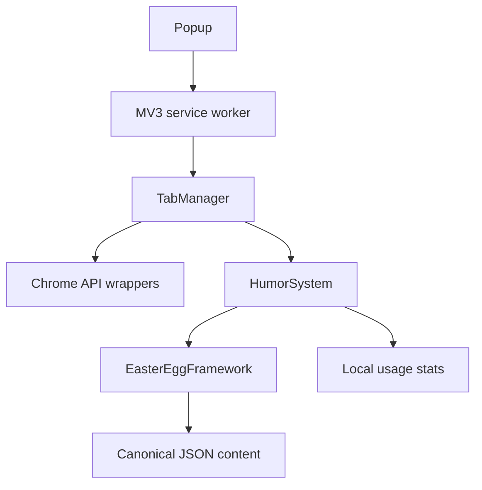

# TabbyMcTabface


TabbyMcTabface is a privacy-first Chrome extension for organizing tab chaos, closing a deliberately confirmed random tab, and receiving commentary from the Skeptical Wombat.

[](https://github.com/Phazzie/tabbymctabface/actions/workflows/ci.yml)
[](./LICENSE)
[](https://developer.chrome.com/docs/extensions/develop/migrate/what-is-mv3)

## What it does

- Groups selected tabs in the current Chrome window under a name you choose.
- Offers an “I'm Feeling Lucky” cleanup action with a confirmation step.
- Protects the active tab and pinned tabs from random cleanup by default.
- Shows live current-window tab and group totals plus locally persisted usage stats.
- Delivers 75 base quips and 204 context-aware easter eggs.
- Keeps all processing on-device: no accounts, analytics, ads, remote code, host permissions, or content scripts.

The easter-egg collection spans familiar references and genuinely odd corners of culture. The 100-entry expansion includes 20 EverQuest eggs, plus pop culture, protocol folklore, math and science, material history, acoustic oddities, deep games, lost-web archaeology, and regional rituals.

## Install a release build

Chrome Web Store publication is the final owner-operated step. To test the verified package locally:

1. Download or build `TabbyMcTabface-v1.0.0.zip`.
2. Extract it to a permanent folder.
3. Open `chrome://extensions` and enable **Developer mode**.
4. Choose **Load unpacked** and select the extracted folder.
5. Pin TabbyMcTabface from Chrome's extension menu.

The unpacked folder must contain `manifest.json` at its root. Do not select the repository root or an outer ZIP directory.

## Develop and verify

Requirements: Node.js 20 or 22 and npm 10 or newer.

```bash
git clone https://github.com/Phazzie/tabbymctabface.git
cd tabbymctabface
npm ci
npm run verify
```

Useful gates:

```bash
npm run typecheck          # strict TypeScript contracts
npm run lint               # source and test linting
npm run test:unit          # focused module tests
npm run test:integration   # multi-component tests with Chrome fakes
npm run test:coverage      # coverage thresholds
npm run build              # bundled MV3 extension in dist/
npm run test:smoke         # static package/installability checks
npm run test:e2e           # persistent-Chromium extension flows
npm run package            # validated Chrome Web Store ZIP
```

The first local browser run may need:

```bash
npx playwright install chromium
```

Never commit `dist/`, Playwright profiles, coverage output, or release ZIPs.

## Architecture

TabbyMcTabface follows Seam-Driven Development: identify boundaries, define typed contracts, write boundary tests, and only then implement. Expected failures use `Result<T, E>` rather than control-flow exceptions.



Important runtime properties:

- The service worker uses idempotent cold-start initialization before every event handler.
- Background and popup entry points are bundled, so Chrome never receives unresolved TypeScript-style imports.
- Runtime humor content comes from one schema-validated JSON source.
- Easter-egg rules use AND semantics, fail closed for unsupported conditions, and rank precise matches above broad ones.
- Tab operations are scoped to the current window.

## Project map

| Path | Purpose |
| --- | --- |
| `src/contracts/` | Typed seams and error contracts |
| `src/impl/` | Chrome adapters and domain implementations |
| `src/data/quips/` | Canonical quip and easter-egg data |
| `src/ui/` | Popup controller, markup, and styles |
| `tests/smoke/` | Built-artifact and ZIP validation |
| `tests/e2e/` | Real Chromium extension flows |
| `scripts/` | Cross-platform build, package, and validation tools |
| `store-assets/` | Chrome Web Store artwork and verified screenshot |

See [BUILD.md](./BUILD.md) for artifact details, [docs/USER_GUIDE.md](./docs/USER_GUIDE.md) for usage, and [CONTRIBUTING.md](./CONTRIBUTING.md) before changing a seam.

## Privacy and permissions

| Permission | Local use |
| --- | --- |
| `tabs` | List and operate on tabs in the current window and derive temporary quip context. |
| `tabGroups` | Create, name, inspect, and count tab groups. |
| `notifications` | Show action results and quips. |
| `storage` | Persist non-identifying counters and preferences locally. |

Tab URLs and titles are not persisted or transmitted. Read the full [privacy policy](./PRIVACY.md), [security policy](./SECURITY.md), and [support guide](./SUPPORT.md).

## Easter-egg content policy

Every entry must have a unique ID and type, valid conditions, a supported humor level and difficulty, compilable regular expressions, and non-empty copy. The content test enforces those rules and the exact collection size.

The sole public hint remains: try exactly 42 tabs.

## Release

`npm run package` builds from a clean directory, validates every manifest and HTML reference, rejects unresolved local imports, checks icon dimensions and content schemas, then produces a ZIP whose root matches `dist/`. Tag workflows rebuild and checksum the same artifact; publishing it in the Chrome Web Store still requires the repository owner's store account and final disclosure review.

Store copy and permission justifications live in [STORE_LISTING.md](./STORE_LISTING.md).

## License

[MIT](./LICENSE) © 2025–2026 Phazzie.
